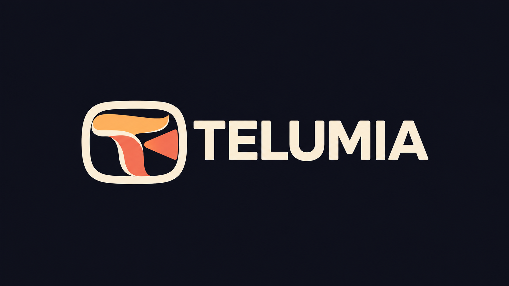

# Telumia

**Seu cinema, suas séries e novelas — com foco no Brasil.**

Telumia é um aplicativo open source para PC e Android TV. Reúne catálogos, biblioteca, perfis e reprodução de fontes configuradas por você, com uma experiência cinematográfica e navegação por controle remoto.

## Downloads

Baixe o MSI Windows, APK Android TV universal ou a variante da sua arquitetura na [versão 0.2.1-alpha.1](https://github.com/Pepeu2010/telumia/releases/tag/v0.2.1-alpha.1). Ela inclui a identidade Telumia, busca Brasil, incrementos de Home/detalhes, base de metadata temporal, cache configurável e editores locais de avatar. Releases anteriores preservam seus arquivos e nomes históricos.

Os APKs disponíveis nesta etapa são Android TV Full Debug, assinados para desenvolvimento. Não há interface específica para celulares nem pacotes Linux/macOS publicados. Cada release informa o alcance da validação e inclui checksums SHA-256.

## Marca própria e prioridade para o Brasil

- Logo original, nome Telumia, ícones, banners de TV e instalador próprios.
- Português do Brasil como idioma inicial dos metadados TMDB em perfis novos, preservando preferências salvas.
- Busca por **Iludida** também consulta **Sadakatsiz**, **The Unfaithful** e **A Woman Scorned**, sem confundir a série com obras de identidade diferente.
- A resolução de metadados procura a edição brasileira de 78 capítulos entre as fontes instaladas. Preserva os IDs de reprodução e a numeração da origem. Se o catálogo instalado só oferecer a edição de 31 episódios, conserva essa edição; não cria capítulos fictícios.
- Proteção contra aplicar títulos/resumos/miniaturas de episódios da edição original sobre a numeração do corte brasileiro.

As edições têm durações e divisões diferentes. Para assistir aos 78 capítulos é necessário configurar uma fonte que ofereça essa edição. [Implementação, fontes e limites](docs/TELUMIA.md).

## Recursos existentes e melhorias em andamento

Os clientes nativos preservam contas, perfis, biblioteca, addons, busca e seus players. A fundação acrescenta movimento completo/reduzido/desligado e intensidade por perfil, proteção de diagnósticos e melhorias de foco/menu lateral. A escolha de menu clássico/moderno na TV preserva configurações abertas, foco e a ação Voltar.

Os detalhes de filmes oferecem ações diretas de reprodução, biblioteca, trailer e assistido; sinopse integral no PC; apresentação adaptativa e foco por D-pad na TV. O incremento foi compilado, validado em múltiplas resoluções e incluído na `0.2.1-alpha.1`. [Evidências da interface](docs/CINEMATIC_DETAILS.md).

A Home recebeu um novo destaque com metadata real, seleção direta por teclado, pausa do carrossel ao interagir e cards com foco evidente no PC. Na TV, o painel de metadata é mais compacto e adapta conteúdo e acessibilidade aos previews. O incremento passou em testes nativos e builds e está na `0.2.1-alpha.1`. [Entrega, capturas e limites](docs/TELUMIA_HOME.md).

A timeline dos dois players já recebe os segmentos temporais disponíveis de intro, recap e créditos, com validação, procedência e limpeza ao trocar de conteúdo. A fundação de providers prepara Scene Info, capítulos e bookmarks; esses recursos completos ainda precisam ser entregues. Passaram 93 testes Desktop, 83 TV, os builds nativos e nove testes de D-pad em múltiplas resoluções. [Integração e limites](docs/TIMED_METADATA.md).

Os dois clientes oferecem orçamento de cache Auto/Manual por aparelho, com quotas para os carregadores existentes de imagens/badges e GIFs do PC. A configuração tem persistência e tratamento de falha. Passaram 106 testes Desktop, 13 de armazenamento isolado, 96 TV, MSI/cinco APKs e nove testes nativos de D-pad/persistência. A integração de todos os tipos de cache e o funcionamento offline completo continuam pendentes. [Comportamento e evidências](docs/MEDIA_CACHE.md).

O Desktop inclui um editor de avatar pessoal com arquivo local, clipboard, drag-and-drop, recorte, zoom e versões otimizadas, além de 64 avatares licenciados com nomes em português. A seleção fica isolada por conta/perfil no aparelho e preserva os campos de sincronização existentes. O gate atual passou 149 testes selecionados e MSI; oito capturas e o decoder sobre os módulos empacotados têm evidências próprias. Os gestos do seletor/clipboard/Explorer ainda precisam de QA no Windows. O editor e as correções de salvamento estão na `0.2.1-alpha.1`. [Entrega e limites do Profile Studio](docs/PROFILE_STUDIO.md).

A seleção de perfis do PC e da TV recebeu cartões próprios, disposição adaptativa, foco por teclado/D-pad e background relacionado ao perfil. Esse incremento posterior passou 155 testes selecionados e MSI no PC; na TV, 111 testes selecionados, cinco APKs e 15 testes nativos nas três resoluções. Dez capturas finais foram revisadas. A nova seleção ainda não integra os binários da `0.2.1-alpha.1`.

O código posterior também usa os pesos reais da fonte Manrope e mede a ocupação dos diretórios conhecidos de cache sem percorrer arquivos pessoais. Preserva configurações de versões futuras e impede novas escritas abaixo da reserva de espaço livre. O conjunto passou 168 testes selecionados no PC, 120 na TV, MSI/cinco APKs e 16 testes nativos de cache/fonte em Android 7 e Android 16. As capturas de perfis e os controles exportados do player foram revisados. Estes incrementos ainda aguardam uma nova release. [Cache](docs/MEDIA_CACHE.md) e [tipografia](docs/TYPOGRAPHY.md) detalham a validação e suas limitações.

O cliente TV também oferece biblioteca integrada, importação de foto local, clipboard de imagem e editor de recorte por controle remoto. Passaram 111 testes unitários selecionados, quatro testes raster Android e cinco testes de interface em cada resolução: 720p, 1080p e 4K. A validação usa emulador, com 12 capturas revisadas; há refinamentos visuais e fluxos de conta/aparelho físico pendentes. O editor está na `0.2.1-alpha.1`. [Código TV](https://github.com/Pepeu2010/telumia-tv).

A implementação integral continua em execução. O redesign completo de Home/detalhes, Profile Studio, cache Auto, thumbnails/timeline, Source Intelligence, Live TV/EPG, Scene Info e controle local pelo celular **ainda não estão concluídos**. Não apresentamos controles de funcionalidades inexistentes. Os critérios completos permanecem no [roadmap aprovado](docs/ROADMAP.md) e na [especificação](docs/APPROVED_SPEC.md).

A [meta integral vigente](docs/GOAL_OBJECTIVE_2026-10-05.md) exige transformar profundamente todas as superfícies e a experiência de uso, preservando a infraestrutura funcional. Troca de marca, temas ou releases intermediárias não representam a conclusão desse objetivo.

O ciclo de hover dos cards do PC recebeu exclusividade, cancelamento, timeout e movimento por perfil: 174 testes selecionados e MSI passaram. A TV acrescenta consultas limitadas e vaga exclusiva no Media3, com preload conservador: 137 testes, cinco APKs e oito testes nativos de áudio local/ownership em Android 7 e 16 passaram. Trailers embutidos Windows e vídeo remoto ainda precisam de implementação/validação. Estes incrementos aguardam nova release. [Entrega e limites dos previews](docs/PREVIEWS.md).

O código de TV também ganhou Momentos salvos: timestamp com nome/data, renomear, remover e voltar à cena, com persistência por conta/perfil/episódio fora do cache. Fontes diferentes exigem confirmação do corte. Passaram 153 testes selecionados, cinco APKs e 16 execuções nativas do painel em Android 7/16 e 720p/1080p/4K. O Desktop e a validação completa no player ainda estão em andamento; esse incremento aguarda nova release. [Comportamento e evidências](docs/SCENE_BOOKMARKS.md).

## Código e desenvolvimento

| Repositório | Plataforma |
|---|---|
| [telumia](https://github.com/Pepeu2010/telumia) | Documentação, evidências e releases |
| [telumia-desktop](https://github.com/Pepeu2010/telumia-desktop) | Kotlin Multiplatform/Compose, libmpv e ponte nativa Windows |
| [telumia-tv](https://github.com/Pepeu2010/telumia-tv) | Kotlin/Compose TV e Media3 |

Cada cliente mantém seu build e histórico. Não há um aplicativo paralelo. Os commits upstream, builds baseline e auditorias estão documentados nesta árvore. As 46 falhas herdadas das suítes completas permanecem registradas; testes direcionados não equivalem à validação integral de conta, sincronização, playback ou performance em aparelho físico. [Fundação e evidências](docs/NATIVE_FOUNDATION.md).

## Conteúdo e licenças

O aplicativo não inclui canais, listas ou conteúdo protegido. Configure fontes que você tenha autorização para usar. Código GPL-3.0, com avisos e [créditos de origem preservados](docs/UPSTREAM_CREDITS.md). A identidade visual Telumia é própria.
