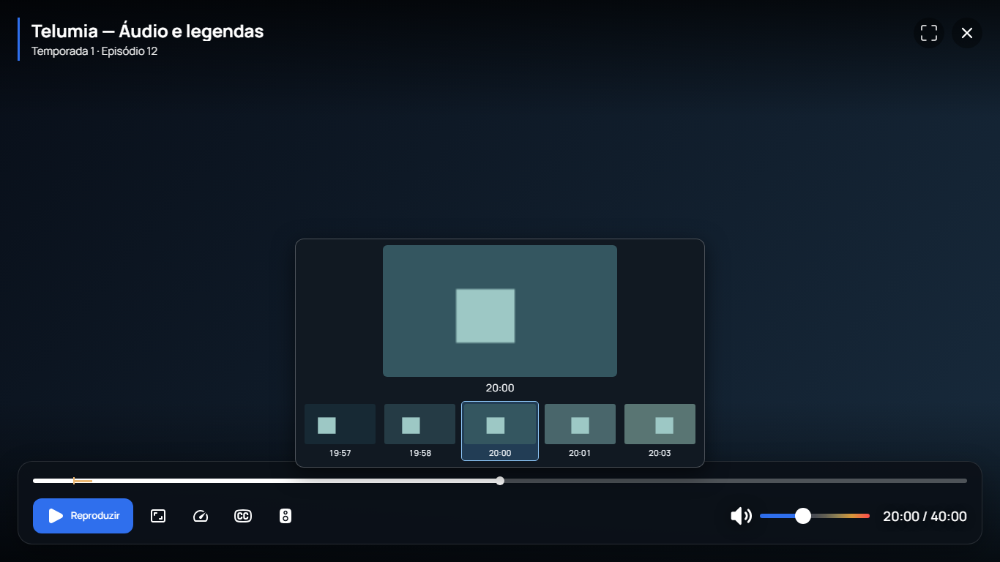

# Incremento 0.2.2-alpha.1

Esta [alpha publicada](https://github.com/Pepeu2010/telumia/releases/tag/v0.2.2-alpha.1) reúne o código posterior à release 0.2.1: navegação/motion, seleção de perfis, reconciliação de coleções e addons nos contratos Nuvio, momentos salvos e thumbnails/filmstrip/composição do player Windows. Também remove uma injeção não utilizada na Application TV e limita a escala de foco das ações de momentos salvos. Os [22 assets remotos foram conferidos](telumia-v022-release-verification.json). O plano integral permanece em execução.

## Fontes e pacotes

| Cliente | Commit empacotado | Gate selecionado |
|---|---|---|
| Windows | `b39b6ea79d37b7c9eb1383ef68692dd2309d664d` | 268 testes, 62 arquivos JUnit; MSI |
| Android TV | `e1962f736410a288f3a8db92fa6d2eaa4eaaa66b` | 200 testes, 39 arquivos JUnit; cinco APKs e APK de testes |

Zero falhas, erros e skips nos gates selecionados. Ambos os builds registram as mesmas árvores limpas antes/depois. O Windows usa versão MSI numérica 1.2.2, nome do aplicativo 0.2.2-alpha.1 e UpgradeCode Telumia preservado. A TV usa 0.2.2-alpha.1, versionCode 2020 e IDs próprios. APKs continuam Full Debug de desenvolvimento.

[Resultados](telumia-v022-results.json), [inspeção dos pacotes](telumia-v022-package-inspection.json), [binding Desktop](telumia-v022-desktop-r1-build-binding.json) e [binding TV](telumia-v022-tv-r1-build-binding.json). O [manifesto preparado](telumia-v022-release-manifest.json) fixa hashes, fontes e inspeções dos ZIPs. Os 142 objetos LFS Desktop foram conferidos; não ficaram ponteiros sem conteúdo.

## Player Windows

O player real conserva libmpv e sua ponte nativa. Metadata fica no masthead e timeline/ações no dock limitado, com composição PiP própria. O rótulo de reprodução agora aparece visualmente. Thumbnails e filmstrip utilizam worker separado, timestamps obtidos do decoder, cache por conta/perfil/fonte e cancelamento; não fazem seek no player principal.

Os cinco casos JNI verificam vídeo local, HTTP controlado com headers contendo vírgula/barra, cancelamento, frames vizinhos distintos e reprodução/seek/resume do player principal em HWND próprio. O caso principal também rejeita headers com NUL/CR/LF, com erro genérico e nenhuma requisição HTTP antes da abertura válida. Alterações equivalentes nos bridges Linux/macOS estão no código; somente Windows foi compilado/executado neste gate.

[Renderer](telumia-v022-renderer-qa.json): oito execuções, quatro resoluções entre 1366×768 e 4K, sistema com/sem movimento reduzido, 72 pares de política/intensidade e **1.052 verificações**, sem erros JS. As capturas 1366×768 e 4K foram revisadas; verificam composição/rótulo/limites de viewport. Fundo e PNGs de filmstrip são fixtures controladas do renderer, não vídeo real. A prova JNI é independente.

## Painel e inicialização TV

O painel real de momentos salvos mantém persistência, renomeação, exclusão, confirmação de outro corte e retry. O botão largo de retorno ao timestamp deixa de crescer sobre Renomear; as outras ações usam a política de movimento da interface.

[Gate nativo](telumia-v022-native-gates.json): **12 execuções** em Android 36, quatro casos por framebuffer nativo 720p/1080p/4K, português brasileiro. As seis capturas do painel/confirmação foram revisadas: texto, foco e ações cabem na tela. A entrada de texto usa a semântica do componente e o IME próprio; as ações/foco usam D-pad. A reprodução efetiva de vídeo ao selecionar o bookmark é um gate separado.

A MainActivity real passou na [inicialização Android 36](telumia-v022-startup-api36-qa.json) e na [inicialização Android 24](telumia-v022-startup-api24-qa.json), com o mesmo APK preservado: processo vivo, Activity retomada, nenhum crash/ANR nos 30 segundos observados em cada API. A captura da Activity e logs brutos permanecem privados. A dependência removida da Application era não utilizada; MainActivity e outros consumidores conservam o serviço existente. Esse resultado não prova ausência de todos os ANRs nem resolve automaticamente toda navegação/performance.

Os emuladores pertencem à QA do projeto. Cada caso restaurou o config de display e encerrou seu emulador; a disponibilidade de um aparelho físico continua como limite próprio, sem suspender as demais implementações.

## Limites do incremento

Não há prova autenticada entre uma conta real nos clientes oficial e Telumia. O backend continua sem CAS para snapshots globais, e importação de convidado/conflitos simultâneos ainda exigem trabalho. Dados exclusivos locais não são apresentados como sincronizados pelo cliente oficial.

O gate Chromium não prova interação completa com WebView2, foco da janela de bookmarks sobre vídeo, DPI/sofa/HDR/GPU físicos. A QA TV do painel não representa todo o app, teclado completo do controle ou performance de uma TV Box física. As suítes completas mantêm suas falhas herdadas registradas; os números acima são dos testes selecionados.

Scene Info, Source Intelligence, thumbnails TV, Live TV/EPG, Phone Remote, downloads avançados, Smart Collections e o restante do redesign continuam pendentes no [roadmap](ROADMAP.md). A publicação possui um registro próprio em [releases](RELEASES.md).
