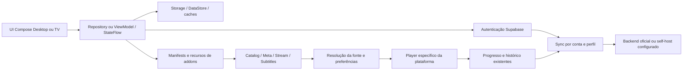

# Auditoria de arquitetura — Fase 0

Data de referência: 2026-10-03, America/Sao_Paulo. Os seis checkouts reais e os
commits completos estão em [upstream-lock.json](upstream-lock.json). A auditoria
é estática; execução de builds é registrada separadamente em BASELINE.md.
Não significa validação de conta, fonte, TV física, HDR ou UI em execução.

## Estrutura encontrada

| Projeto | Estrutura e responsabilidade | Evidência no checkout |
|---|---|---|
| Desktop | KMP/Compose; UI e repositories em commonMain; integrações JVM/native em desktopMain; source sets Windows/non-Windows; Android/iOS também presentes | `repos/desktop/settings.gradle.kts`, `composeApp/build.gradle.kts` |
| TV | App Android, flavors Full/Playstore; Hilt, ViewModels, StateFlow, Navigation Compose; módulos baselineprofile e ffmpeg-decoder-downmix | `repos/tv/settings.gradle.kts`, `app/build.gradle.kts`, `core/di` |
| Mobile | KMP/Compose na branch cmp-rewrite; comparação de contratos e código compartilhado, não base para trocar a UI Desktop | `references/mobile/settings.gradle.kts`, `composeApp/src/commonMain` |
| self-host | Docker Compose, serviços Supabase, dashboard, migrations, discovery de backend | `references/self-host/README.md`, `docs/architecture.md`, `database/migrations` |
| engine | C++20/libtorrent; scheduling, cache e HTTP range local; APIs em desenvolvimento | `references/engine/README.md`, `CMakeLists.txt`, `platform` |
| TVSmart | JavaScript/HTML/CSS e APIs Tizen/webOS; serviços locais e capacidades por versão | `references/tv-smart/README.md`, `js/core`, `services` |

Desktop usa Gradle 9.4.1, Kotlin 2.4.10, AGP 9.2.0, Ktor 3.4.1, Coil 3.6.3 e
Supabase 3.4.1. TV usa Gradle 8.13, Kotlin 2.3.0, AGP 8.13.2, Media3 1.8.0,
Ktor 3.1.1, Supabase 3.2.1 e SDK 36. Os dois CIs selecionam JDK 17.
Evidência: wrappers, `gradle/libs.versions.toml` e workflows de release.
Não unificar versões/AGP como condição para começar o fork.

## Navegação, estado e inicialização

Desktop: `App.kt` instala ambiente, tema e image loader; `AppGate` controla a
entrada; `MainAppContent.kt` observa autenticação/perfil e solicita pulls no
foreground. Há repositories singleton com StateFlow, coroutines e expect/actual
para operações de plataforma. Não converter esse fluxo inteiro para DI nova.

TV: `core/di` fornece clientes/repositories por Hilt. `NuvioNavHost.kt` conserva
o fluxo detalhe/fontes/player. ViewModels e DataStores concentram estado e
persistência. `HomeScreenFocusState.kt` armazena chaves de linhas/cards, anchors
de scroll e estado salvo; `FocusRestoreUtils.kt` trata retorno aos detalhes.
A fundação de foco existente deve ser ampliada e testada, não substituída por
índices de posição que ficam obsoletos durante paginação.

## Fluxos reais de dados

`SyncManager.kt` Desktop ordena operações, usa cancelamento por conta/perfil e
pausa transições automáticas durante pulls. TV divide operações em services de
Startup, Profile, Library, WatchProgress, WatchedItems, Addon, Plugin,
ProfileSettings, Collection, HomeCatalog e ProviderCredential.
Os adaptadores de library/progress/watched já suportam deltas e reconciliação.
Não substituir por push total ingênuo nem apagar dados offline após timeout.

## Player e streaming

Windows: `PlayerEngine.desktop.kt` conecta Compose a NativePlayerController,
NativePlayerBridge/JNI e `desktopMain/native/windows/player_bridge.cpp`.
O runtime usa libmpv; controles locais ficam em `resources/player-ui/controls.*`
com WebView2. Há rotinas de tracks, seek, velocidade, legendas, fullscreen,
now-playing, inibição de sleep e teardown. A nova timeline precisa atender essa
superfície, além de `PlayerTimeline.kt` em commonMain. Alterar só o slider Compose
não comprova alteração do player Windows real.

macOS/Linux possuem bridges próprios; MPVKit é submodule para a plataforma
Apple. O checkout Windows não precisa compilar MPVKit para demonstrar seu build.

TV usa Media3 e também possui integrações nativas opcionais de MPV, FFmpeg e
Dolby Vision. Preservar seleção de engine/capacidades existente. `PlayerScrubRates`
já implementa passos 10/20/30/60 s por repetição. `TrailerPlayerPool` possui
acquire/stop/yield/reclaim/release para disputar recursos de decoder com o player
principal. Não criar um novo player para cada card focado.

O nuvio-engine é engine de torrent, não uma substituição da UI nem do decoder.
Sua adoção permanece experimental até validar APIs, binários e comportamento.

## Addons, metadata e segurança de execução

Desktop: `AddonManifestParser` aceita resources como strings ou objetos,
types/idPrefixes, catalogs/extras, behaviorHints e URLs relativas de assets.
`AddonRepository` já instala, remove, ordena, habilita e atualiza manifests por
perfil. TV usa Retrofit/Moshi (`AddonApi`) e `AddonRepositoryImpl`.
Catalog/meta/stream/subtitles têm contratos existentes que devem ser preservados.

Plugins executáveis são outra superfície: QuickJS, fetch, DOM, crypto e WASM.
Desktop já limita concorrência a dez e tempo de execução; TV limita tempo e
corpo de fetch. Esses limites não demonstram isolamento de processo nem proteção
completa contra exaustão nativa. Não confundir manifest HTTP com código executado.

Metadata combina addons e enriquecimentos configurados, incluindo TMDB,
Trakt, SIMKL e MDBList. Não hardcodar chaves nem criar dependência paga para as
novas funções. Trailers e suas resoluções já existem; novas fontes só serão
adicionadas com contrato e disponibilidade verificados.

## Persistência, downloads, imagens e cache

Desktop: `DesktopStorage.kt` resolve Application Support/AppData/XDG e mantém
stores em arquivos properties; nomes e diretórios atuais usam Nuvio. Há cached
profiles, PIN, library, progress, settings, downloads e metadata. A instalação
independente exige separar todos esses caminhos, inclusive WebView2 e runtime
nativo, antes de executar o fork junto do oficial.

Downloads já possuem repository, estados e expect/actual. O downloader Desktop
usa HTTP e abre a localização por argumentos de processo; isso não é, por si,
evidência de shell injection. Qualquer alteração precisa validar paths e impedir
execução derivada de dados de addons. Não usar downloads como cache descartável.

Coil já fornece cache e image pipeline. Desktop faz downscale para Windows em
`AsyncImage.desktop.kt`; TV tem caches HTTP separados de 50 MB e tokens de
layouts. `MetaDetailsRepository` mantém mapa de metadata em memória. Não foi
encontrada uma política única que limite todas as categorias solicitadas.
A política Enhanced terá defaults configuráveis e Auto; integrar os caches
existentes gradualmente, sem duplicar imagens baixadas nem apagar dados duráveis.

## Duplicação e compartilhamento adequado

Comparação das árvores nos commits fixados: Desktop tem 763 blobs commonMain,
Mobile 728; 726 caminhos coincidem e 555 blobs são idênticos. Isso é evidência de
parentesco forte, não autorização para substituir arquivos divergentes.
TV tem DI, stores, DTOs e ciclos Android próprios.

Compartilhar novas regras puras: políticas de cache, scoring, timed metadata,
bookmarks, filtros e preferências Enhanced. Usar adaptadores na borda dos
repositories reais. Compartilhar identidade visual como valores/tokens, mantendo
composições Desktop/TV próprias. Não extrair auth/sync inteiro na primeira fase.

## Pontos frágeis e riscos prioritários

| Risco | Evidência | Consequência / tratamento |
|---|---|---|
| URL de addon em log | `AddonRepository.kt`, removeAddon e refresh | Pode conter segredos em path/query; redaction na fundação |
| TLS permissivo de addon | TV `NetworkModule.kt`, trust manager e hostnameVerifier | Exceção explícita para addons; manter first-party validado e desenhar consentimento por origem |
| Dados de instalação misturados | `DesktopStorage.kt`, diretório WebView2 nativo | Isolar paths e cache; nunca migrar/apagar dados oficiais silenciosamente |
| Updater oficial | ambos os repositories de atualização | Separar feed e assinatura antes de distribuir o fork |
| Credenciais de build e assinatura | configurações geradas, local.example.properties, TV signingConfigs | Baseline local não comprova login; usar configuração local ignorada e assinatura própria |
| Novas preferências no sync | ProfileSettings blob e lista de features | Não enviar campos Enhanced ao servidor sem contrato confirmado |
| Decoder disputado por previews | pool de trailers TV e superfícies Desktop | Ownership global, cancelamento e yield durante playback |
| Source of truth de timeline | JNI/WebView2, Compose e Media3 | Timed metadata genérica na Fase 2; testar cada superfície real |
| Globalização/TV modesta | textos, dimensões, lazy lists e efeitos | QA de idiomas, foco, overscan e 2 GB físicos; não afirmar a partir de emulador |

## Testes, CI e release

Desktop possui commonTest, desktopTest e Android host tests; TV possui unit tests
de foco, scrub, sync, trailers e updater, além do módulo baselineprofile.
Workflows de release compilam pacotes nativos e APKs com configuração própria.
Preservar testes existentes; acrescentar fixtures locais de contrato e isolamento.
GPL/atribuições ficam preservadas nos clientes; self-host tem Apache-2.0 e NOTICE.
Não publicar PRs de redesign nos upstreams: esta execução é um fork independente.

Limitações: inspeção não cobre execução de cada linha, conta real, backend em
produção, todos os providers, playback ou segurança completa do runtime nativo.
Essas verificações têm critérios separados no roadmap e na matriz de compatibilidade.
