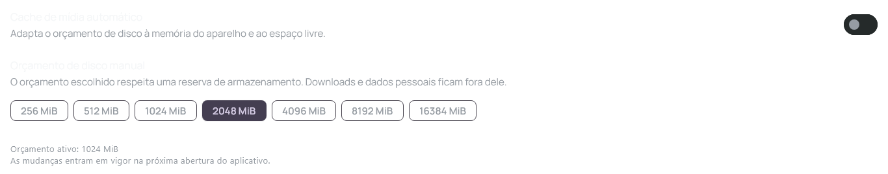
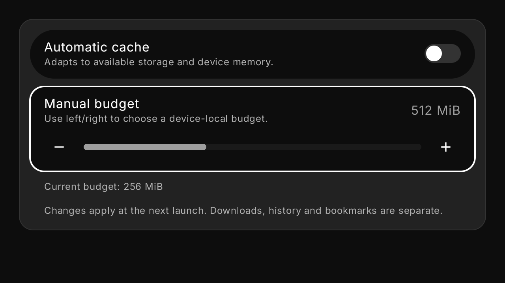
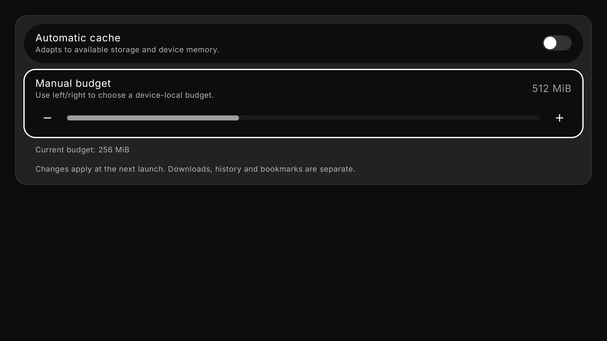

# Telumia — cache configurável por aparelho

Incremento nativo de 6 de outubro de 2026. Os dois clientes foram compilados e testados. A política central completa para todos os tipos de dados ainda não está concluída.

## Comportamento implementado no Desktop

O modo Auto começa em 1 GiB, adapta o orçamento à memória detectada e ao armazenamento disponível e mantém reserva de 2 GiB. Manual permite escolher outro orçamento, inclusive superior ao default, respeitando o espaço disponível. A configuração pertence ao aparelho, em armazenamento Telumia versionado, e vale a partir da próxima abertura.

Os carregadores existentes de imagens/badges e o cache de GIFs usam quotas da política central. GIFs têm limites de bytes, quantidade e tamanho por entrada; nomes derivados de hash; substituição atômica e eviction por uso recente. Arquivos antigos de GIF são lidos e migrados sob demanda, sem exigir rede. Eles ainda precisam de contabilização/migração global para assegurar um teto sobre todo o legado.

Quando a reserva impede escrita, os carregadores preservam leitura dos caches disponíveis. Requests individuais de fundos/badges respeitam a política. Downloads, bookmarks, histórico, configurações e arquivos de usuário não pertencem às quotas de mídia. As outras categorias possuem quotas preparadas, mas seus consumidores ainda precisam ser integrados.

Salvar uma preferência ocorre fora da thread de interface, desabilita novas edições durante a operação e mantém a seleção anterior se falhar. A gravação existente de preferências Desktop agora substitui o arquivo de maneira atômica quando suportado; um erro em `putString` restaura também o valor em memória.

## Gates Desktop

- 106 testes selecionados, sem falhas/erros/skips, e MSI real após revisão visual e correção do contraste do aviso de reinício.
- 13 testes adicionais de armazenamento/tema/persistência, sem falhas/erros/skips, com APPDATA temporário isolado. Uma primeira execução sem habilitar esse sandbox pulou corretamente o teste que protege o diretório real do usuário; a execução isolada cobriu esse teste.
- O runtime distribuído contém `java.management` e `jdk.management`, necessários à leitura da memória no JVM existente.
- [Resultados do cache](telumia-cache-results.json), [armazenamento isolado](storage-isolated-results.json) e [inspeção MSI](telumia-cache-desktop-package-inspection.json).

A captura usa um orçamento controlado para verificar os controles e a informação de que alterações exigem reinício. Não demonstra a operação completa do aplicativo offline nem o uso total de disco de todas as features.

## Continuidade obrigatória

A TV integra default de 256 MiB, Auto baseado em RAM/armazenamento, escolha Manual por D-pad e reserva de 256 MiB. Seus carregadores existentes de imagens/badges recebem quotas e política somente leitura quando a reserva impede escrita; backgrounds e revalidação respeitam a mesma política. A configuração é local ao aparelho, possui estado de gravação/erro e aplica mudanças na próxima abertura.

Passaram 96 testes unitários selecionados, sem falhas/erros/skips, e foram gerados os cinco APKs e o APK de instrumentação. Nove testes nativos em 720p/1080p/4K verificaram D-pad, seleção Manual/Auto, persistência real em SharedPreferences e fallback de schema futuro. Capturas e hashes estão na [instrumentação TV](telumia-cache-tv-ui-qa.json); a [inspeção dos APKs](telumia-cache-tv-package-inspection.json) registra sua identidade própria.

Ainda faltam contabilização global de legado, integração das caches de metadata/addons/EPG/previews/thumbnails/filmstrip/Scene Info e avatar remoto, adaptação dinâmica durante a sessão e QA de fluxos offline reais. O limite de armazenamento antes de baixar imagens e a validação de arquivos/URLs também exigem revisão própria. O índice de metadata temporal não substitui um cache de Scene Info.

Esta entrega não encerra a Fase 1-D nem a [meta integral](GOAL_OBJECTIVE_2026-10-05.md). A release `0.2.0-alpha.1` não inclui essas mudanças.

## Contabilização e proteção de versões futuras — 7 de outubro

O snapshot de armazenamento agora inclui o tamanho dos arquivos nos diretórios conhecidos de mídia. No PC, mede as categorias de `media-cache-v1` e os GIFs legados. Na TV, mede `image_cache` e `badge_cache`, usados pelos carregadores existentes. A política Auto recebe esses bytes junto com o espaço livre: preencher o próprio cache não passa a parecer uma perda equivalente de capacidade do aparelho na próxima abertura.

A medição apenas lê atributos de arquivo. Não percorre diretórios pessoais, downloads ou o armazenamento durável de avatares. Ignora symlinks/junctions, verifica o destino dos caminhos e evita contabilizar duas vezes arquivos com a mesma identidade. Possui limites de 16.384 entradas, oito níveis e 100 ms entre operações de filesystem; se uma leitura falhar ou atingir um limite, conserva a soma parcial como estimativa conservadora. Esses bytes representam tamanhos lógicos dos arquivos, não uma medição de blocos físicos do volume. O snapshot continua valendo durante a sessão; adaptação dinâmica e isolamento completo de IO da thread principal seguem pendentes.

Clientes antigos usam defaults na leitura de uma configuração com schema desconhecido, mas recusam sua gravação. O PC também conserva documentos JSON ilegíveis; a TV conserva schemas com tipo incompatível. O erro mantém a preferência anterior na interface. Testes TV agora usam SharedPreferences e diretórios temporários próprios, sem alterar a configuração pessoal do aplicativo.

No PC, passaram inicialmente 163 testes selecionados e o MSI foi gerado em fonte limpa. O pacote desse incremento foi preservado antes das mudanças seguintes. [Vínculo de fonte/build](telumia-cache-occupancy-desktop-build-binding.json) e [inspeção MSI](telumia-cache-occupancy-desktop-package-inspection.json). O conjunto posterior de cache/tipografia passou 168 testes, sem falhas/erros/skips, e preservou outro MSI sobre a fonte limpa. [Vinculação final Desktop](telumia-native-fonts-desktop-bound-build-binding.json).

A contabilização expôs um caso em que somar o cache ocupado ainda concedia escrita quando o espaço livre real estava abaixo da reserva. A política agora concede zero bytes de escrita nessa situação, em Auto e Manual, preservando a leitura dos dados disponíveis. O defeito foi reproduzido no JAR compilado anterior e a correção foi executada no JAR novo com as mesmas entradas controladas. [Reprodução antes/depois](telumia-cache-reserve-reproduction.json). Isso não equivale a encher o disco de um aparelho real.

Na TV, passaram 120 testes unitários selecionados, sem falhas/erros/skips, e foram gerados os cinco APKs e o APK de testes sobre a fonte limpa. Dezesseis testes nativos, oito em cada versão Android API 24 e 36, verificaram persistência, recusa de schema futuro/tipo incompatível, contabilização real nos diretórios conhecidos, exclusão de symlink/dados duráveis, limite de entradas, D-pad e recursos/pesos nativos da fonte. Os hashes vinculam a instrumentação aos APKs preservados. [QA nativa](telumia-cache-occupancy-tv-native.json), [build e pacotes](telumia-native-fonts-tv-build-binding.json). A tentativa anterior passou 118 testes e gerou os APKs do aplicativo, mas falhou ao compilar o APK de testes por usar `Os.unlink`, oculto no SDK público; o fixture foi corrigido para a remoção NIO sem seguir o link.

A TV usa a variante NIO do desugaring para disponibilizar a iteração de diretórios também nas APIs 24/25 suportadas. [Documentação oficial Android](https://developer.android.com/studio/write/java11-nio-support-table). A compatibilidade de todos os fluxos do aplicativo nessas versões não pode ser deduzida apenas da compilação.

Essas alterações são posteriores à publicação `v0.2.1-alpha.1`; seus binários publicados permanecem preservados. A integração completa dos consumidores e o QA offline continuam obrigatórios.
