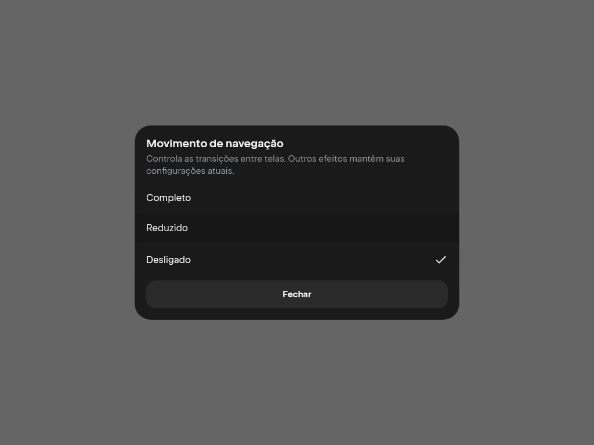
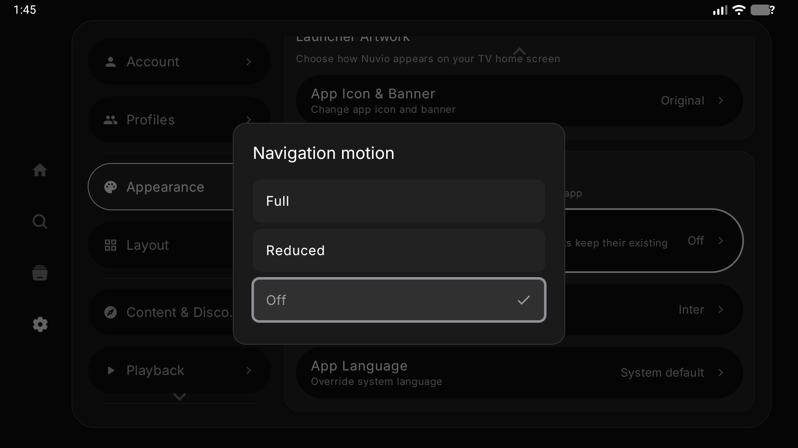
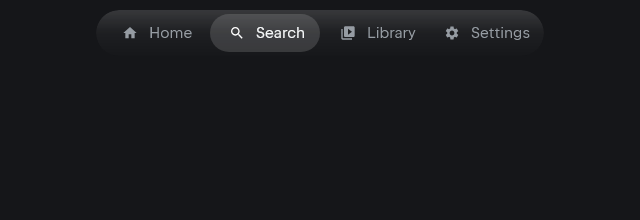
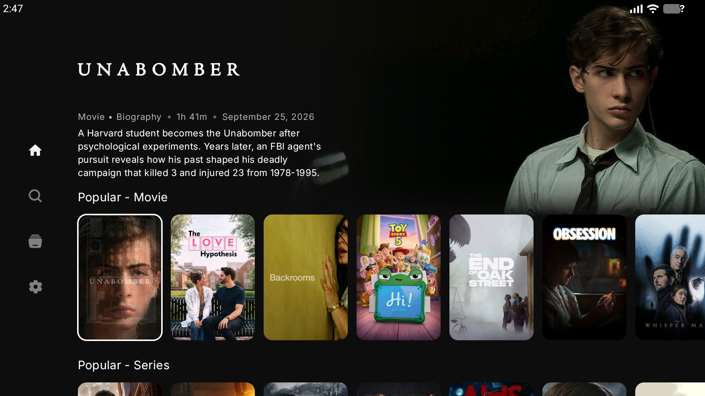
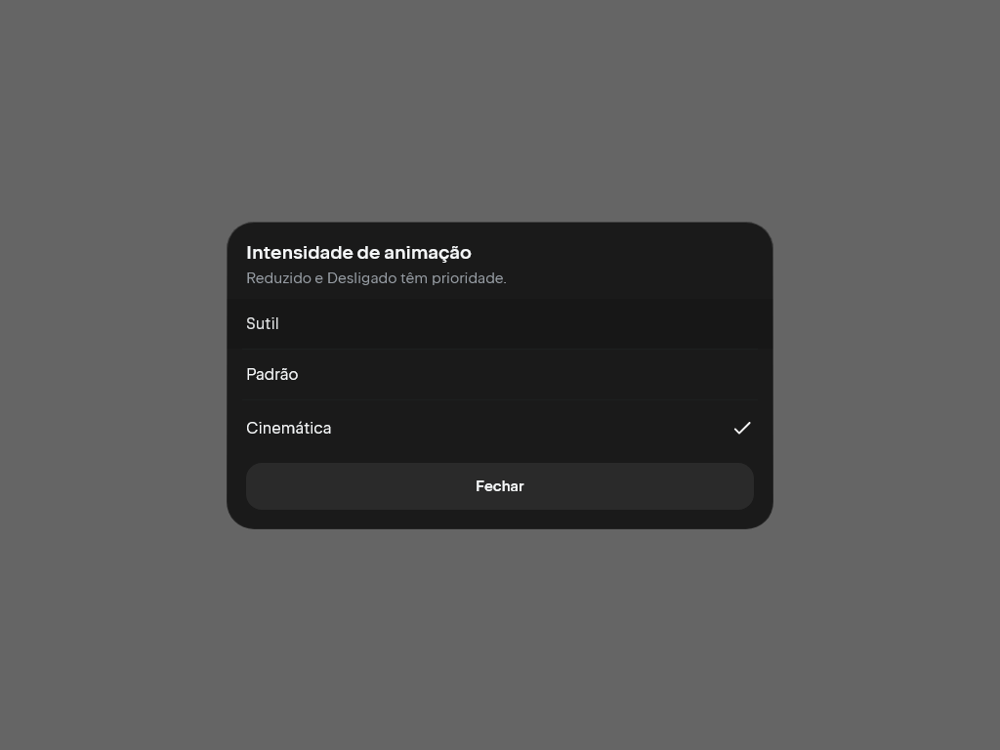
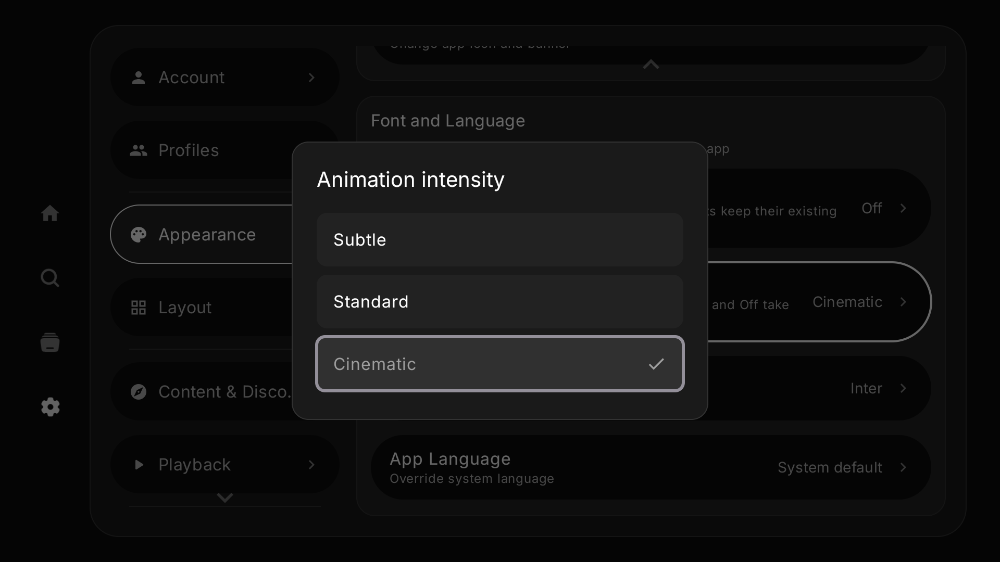

# Fundação visual nativa — milestone 1-A em execução

Este documento registra implementação nos clientes existentes, conforme a regra
aprovada de evoluir o Nuvio. O milestone 1-A completo ainda exige identidade
visual/shell, cobertura de outros efeitos e QA global de navegação TV. A Fase 1
não está concluída. A release `v0.1.0-alpha.1` contém a fundação 0-C anterior a
este incremento; `v0.1.0-alpha.2` distribui o incremento 1-A.1.

## Incremento 1-A.1: movimento de navegação por perfil

### O que já existia e foi reutilizado

Desktop: `core/ui/Tokens.kt` e `Theme.kt` já centralizavam cores, spacing,
tipografia, shapes, elevation, easing e durações. `ThemeSettingsRepository` e
os três `ThemeSettingsStorage` já persistiam preferências por perfil. A área
Aparência já tinha `SettingsNavigationRow`; `TrackingAdaptivePicker` já oferecia
dialog/sheet adaptativos com escolha única. `MainAppContent` usava NavDisplay,
NuvioNavigator e PosterNavigationState; o zoom tinha ownership/lift/land próprio.

TV: `MotionFocusTokens.kt` e `Theme.kt` já concentravam motion/foco, e a tela
`ThemeSettingsScreen` com seu ViewModel, `SettingsActionRow` e
`SettingsSingleChoiceDialog` já permitia escolhas por D-pad. `ThemeDataStore`
e `ProfileDataStoreFactory` já forneciam armazenamento/lifecycle por perfil.
`NuvioNavHost` já tratava separadamente stream/player/autoplay.

### Lacuna e alteração concreta

Não havia preferência de movimento aplicada às transições de navegação desses
clientes. Agora a área Aparência oferece **Movimento de navegação**:

- Completo: mantém a possibilidade de zoom de pôster no Desktop e fades normais.
- Reduzido: remove o zoom de navegação Desktop e limita os fades a 120 ms.
- Desligado: duração zero nas transições de navegação revisadas.

A opção descreve seu alcance: outros efeitos mantêm suas configurações atuais.
Ela não é anunciada como Reduced Motion global. Home, previews, loading, efeitos
de foco e outras superfícies ainda precisam adotar a política nos incrementos
seguintes. O token TV de duração média passa de 350 para 240 ms, dentro da faixa
standard aprovada; Desktop já tinha 220 ms. As preferências anteriores de theme,
OLED, foco, navegação e autoplay permanecem disponíveis.

### Pontos de extensão e arquivos modificados

**Desktop:** `Tokens.kt` recebe a política pequena NavigationMotion;
`Theme.kt`/`App.kt` fornecem a preferência pelo tema existente;
`AppearanceSettingsPage.kt` reutiliza row/picker; `ThemeSettingsRepository.kt`
carrega/recarrega a escolha; `ThemeSettingsStorage.kt` e suas implementações
Desktop/Android/iOS persistem a chave local no store de tema atual;
`MainAppContent.kt` aplica a duração às transições e libera artwork levantado
se o modo muda durante a navegação. Não há outra tela, navigator ou repository.

**TV:** `domain/model/AppTheme.kt` recebe a política; `ThemeDataStore.kt`
amplia o store existente usando ProfileDataStoreFactory para uma área local
`enhanced_local_theme_settings`. Isto é necessário porque o sync original
exporta todas as chaves de `theme_settings`; não se alterou esse sync nem seu
payload. `ThemeSettingsViewModel.kt`/`ThemeSettingsScreen.kt` reutilizam o fluxo
de eventos e o dialog; `Theme.kt`/`MainActivity.kt` fornecem o estado por perfil;
`NuvioNavHost.kt` aplica o modo sem remover os atalhos de autoplay; o token
médio é ajustado no arquivo existente `MotionFocusTokens.kt`.

Strings novas estão nos recursos English/Português dos dois clientes. Os
actuals Android/iOS Desktop foram mantidos coerentes com o expect; não foram
gerados pacotes dessas plataformas neste incremento.

### Validação e limites

**22 testes Desktop e 19 TV aprovados, zero falhas/erros/skips nos conjuntos
selecionados; MSI e cinco APKs compilados.** Os sources do incremento estão nos
commits `a704c6d7b1761484d163f809e27e6af6a72f4757` (Desktop) e
`024e60aca0d6edf190c6eab465c4e335e16a8da4` (TV), também em fork-lock.json.

As tentativas anteriores preservam um erro de posicionamento de `--tests` na
invocação Desktop e um import faltante no primeiro build TV. Ambos foram
corrigidos; os registros de sucesso são `motion-desktop-final` e
`motion-tv-final`. Não há supressão dessas tentativas nos resultados.

Resultados e tentativas em [motion-results.json](motion-results.json); inspeção
dos novos pacotes em [motion-package-inspection.json](motion-package-inspection.json).
As falhas herdadas completas continuam em `phase-0-results.json`.

O teste Desktop de picker renderiza o componente real reutilizado, usa clique
para Reduzido e foco + Enter para Desligado. Capturas dos três estados são
geradas em `composeApp/build/reports/navigation-motion`; a inspeção visual
confere leitura, ausência de corte e indicação da escolha. Isto não valida a
Home inteira, todas as resoluções nem playback.

O teste de persistência Desktop usa APPDATA redirecionado para artifacts e exige
`NUVIO_ENHANCED_ISOLATED_THEME_TEST=1`, protegendo dados reais. Ele verifica
persistência no arquivo e preservação da escolha após replacement do sync.
O teste TV usa DataStore real com arquivos temporários para verificar isolamento
entre perfis e leitura por uma nova instância. O teste do ViewModel verifica o
evento de seleção/persistência e mudanças emitidas pelo perfil ativo.

Não houve alteração nos sources protegidos de auth/sync/API/DTO/transporte dos
addons ou nos motores libmpv/Media3. Nenhuma rota foi acrescentada ou removida;
nenhum Live TV/EPG falso foi exposto. Acessibilidade global, QA de todas as rotas
por D-pad e medições de FPS/aparelho continuam como gates do milestone completo.

### QA instalado no emulador

O APK universal deste incremento foi instalado e executado em AVD dedicado,
1920×1080, RAM configurada em 2048 MiB, renderer SwiftShader. A imagem disponível
é **Android phone API 37.1 x86_64 com páginas de 16 KB**, usando preset TV 1080p;
isto não representa Android TV OS nem performance de uma TV Box física.

O fluxo existente sem conta foi seguido até Home → Settings → Appearance →
Navigation motion. A navegação dentro do app usou D-pad. Completo → Reduzido →
Desligado, retorno de foco à linha e seleção no dialog foram observados. Após
force-stop e relaunch, Desligado continuou salvo, focado e marcado no dialog.
O crash buffer estava vazio ao fim da sessão. O emulador foi encerrado após QA.

O sistema exibiu aviso de alinhamento de bibliotecas nativas x86_64, incluindo
Conscrypt e IAMF, e executou o app em **page size compatible mode**. O aviso do
SO foi dispensado por toque derivado da árvore de UI. Não se declara suporte
nativo a 16 KB nem reprodução validada. A tela original de login apresentou
"QR unavailable" e "An unexpected error occurred"; não houve login/sync.
A causa do erro remoto ainda não foi determinada.

Proveniência, limitações e hashes das capturas em
[motion-ui-qa.json](motion-ui-qa.json). A inspeção de pacotes anterior ao QA
mantém `installed=false` porque registra apenas o estado daquela inspeção.

| Desktop: picker existente | TV: seleção persistida após reinício |
|---|---|
|  |  |

Capturas TV adicionais: [Completo](evidence/1-a-1/motion-dialog-full.png) e
[Reduzido](evidence/1-a-1/motion-dialog-reduced.png). São capturas dos componentes
nativos reais; a identidade/shell completa ainda é trabalho pendente de 1-A.

Para repetir o teste Desktop de persistência no Windows, redirecione **apenas na
sessão do build** APPDATA para uma pasta vazia de artifacts e habilite a variável
de teste acima. Não execute esse teste com APPDATA apontando para dados pessoais.

## Próximo incremento do mesmo milestone

Evoluir a identidade/shell e ampliar a cobertura de motion/foco a partir desses
tokens e superfícies atuais, com renderização/navegação testadas. Os componentes
Live TV/EPG entram na preparação da Fase 1 sem rotas públicas; timed metadata
integra o player na Fase 2, mantendo Scene Info na Fase 7.

## Incremento 1-A.2: shell, foco e skeletons

A preferência existente passa a alcançar também os tokens de duração usados
pelos componentes Desktop, expansão dos rótulos de navegação e o motor Jelly.
Em Reduzido/Desligado, Jelly mantém clique, drag, cancel e destinos limitados,
mas não inicia seu loop de frames nem distorce a superfície. No modo adaptativo,
os rótulos ficam visíveis e estáveis; a escolha explícita Compacto permanece.
Skeletons continuam representando carregamento, com superfície estática nesses
modos. A política é estendida no tema existente, sem outro navigator/store.

Na TV, `MotionFocusTokens` fornece tokens derivados da política e o shell
clássico/moderno os usa para feedback e transições. `ContentCard` e
`GridContentCard` mantêm borda/foco/ações; zoom elástico é retirado nos modos
reduzidos, e expansão de backdrop continua disponível sem animação espacial.
`Shimmer`/`Skeletons` param loops decorativos. Outros call sites ainda precisam
adotar a política; não se anuncia desativação global concluída.

Arquivos Desktop: `Tokens`, `Theme`, `DesktopNavigationBar`, `Shimmer`,
`jelly/JellyMotion`, `jelly/JellyNavigationBar`, `ShelfComponents`,
`ProfileMeshBackground` e seus testes existentes. Hover continua emitindo
interações para os previews, mesmo sem zoom.
TV: `MainActivity`, `ModernSidebarBlurPanel`, `MotionFocusTokens`, `Theme`,
`ContentCard`, `GridContentCard`, `SidebarNavigation`, `Shimmer`, `Skeletons`
e `ThemeAccessTest`. Não houve substituição de players, auth ou sync.

O primeiro teste Desktop encontrou deslocamento do alvo sob o mouse ao expandir
rótulos instantaneamente. O layout adaptativo estável corrigiu a falha sem
remover a navegação. A execução final com a configuração pública correta passou
**25 testes Desktop e 15 TV, zero falhas/erros/skips**, e gerou MSI e os cinco
APKs. A seleção dos testes inclui motor Jelly, interação Compose de navegação,
picker, clique dos posters, tokens, ViewModel e persistência de Aparência.
Não substitui a suíte completa nem resolve as 46 falhas herdadas.

[Resultados das tentativas](motion-shell-results.json),
[inspeção/hashes dos pacotes](motion-shell-package-inspection.json) e
[QA instalado e capturas](motion-shell-ui-qa.json). Os commits registrados
contêm o código compilado; o build ocorreu antes do commit e o README foi
atualizado depois. Configuração pública local é provisionada pelo script e
continua fora do Git. Estes pacotes **não integram a alpha.2 publicada**.

No APK novo, a preferência Off sobreviveu à substituição do pacote. D-pad levou
Home → sidebar → Settings → Appearance, selecionou Reduced e restaurou o foco
na linha. Back retornou por categorias até Home; direita/esquerda moveram o
foco entre cards e sidebar. Borda de foco e rótulos foram inspecionados nas
capturas reais. O crash buffer estava vazio antes da tentativa de reinício.
Na continuação seguinte o processo do emulador estava ausente: não se declara
persistência após reinício verificada neste incremento. A persistência de 1-A.1
continua sendo sua evidência própria, sem ampliar o alcance deste QA.

| Desktop: menu estável em Off | TV: card em Reduced |
|---|---|
|  |  |

O ambiente continua sendo imagem phone API 37.1, preset TV 1080p, 2048 MiB
configurados e SwiftShader. A advertência nativa de 16 KB apareceu novamente.
Não representa Android TV OS, hardware decoder ou performance de TV Box.

### Correção de provisionamento público e QR

A investigação encontrou `local.properties` com URL e chave pública concatenadas
na mesma linha. A causa era `+=` em uma variável inferida como string quando
continha uma única linha. `Initialize-Development.ps1` agora força array de
strings, repara somente a concatenação exata produzida pelo script e preserva
outras configurações. Duas execuções mantiveram o arquivo idêntico e produziram
duas propriedades separadas. A correção altera o provisionamento local, sem
modificar `AuthManager` ou inventar endpoint.

Com o redirect atual do app, o RPC oficial `start_device_login_session` respondeu
HTTP 200 e os campos esperados. No APK recompilado, o QR, código manual e prazo
de expiração foram observados na árvore de UI; não apareceram os erros antigos.
Não foi feito login em conta ou sync. Códigos, URLs temporárias e capturas do QR
não foram exportados. As alphas já publicadas continuam com os pacotes originais;
a correção não foi inserida retroativamente. O Desktop também foi provisionado
com URL/chave pública separadas e recompilado; seu login não foi testado.

## Incremento 1-A.3: intensidade por perfil

Inspeção encontrou os pontos existentes `ThemeSettingsRepository/Storage`,
`ThemeDataStore`, `ThemeSettingsViewModel`, Aparência, pickers, temas e tokens.
Intensidade não tinha uma preferência própria. A extensão acrescenta Sutil,
Padrão e Cinemática nesses mesmos fluxos, com chave local excluída do sync.
Reduzido/Desligado prevalecem sobre intensidade: sem escala espacial e com
fade limitado/instantâneo. A política combinada alimenta navegação, shell,
posters, Jelly e tokens já revisados, sem navigator ou app adicional.

Padrão preserva os valores anteriores; Sutil usa fração 0,65 e Cinemática 1,25
para duração/amplitude. São preferências, não medições de performance. Outros
call sites ainda precisam integrar a política. A identidade própria do shell
e motion global continuam pendentes.

Passaram **32 testes Desktop e 17 TV, zero falhas/erros/skips**. A seleção inclui
tokens/política, navegação Jelly e cards, picker Compose com mouse/teclado,
ViewModel e armazenamento por perfil. No Desktop, a persistência foi testada
com APPDATA isolado, incluindo substituição por sync sem perder a preferência
local e sem exportá-la no payload oficial. A escolha Cinemática foi inspecionada
na captura real do picker. Esses testes não resolvem as 46 falhas herdadas.

MSI foi compilado em 520,59 segundos; TV em 966,78 segundos, com universal e
quatro APKs por ABI. [Resultados](intensity-results.json) e
[inspeção/hashes dos pacotes](intensity-package-inspection.json). Estes builds
continuam **fora da alpha.2** e conservam as versões internas herdadas.

O QA instalado agora usa uma imagem **Android TV API 36 x86_64**, preset 1080p,
2048 MiB configurados, SwiftShader e páginas de 4096 bytes. As features
television/leanback/leanback_only foram confirmadas. O APK universal instalou,
abriu a atividade Leanback e exibiu QR/código/prazo no onboarding Guest; dados
temporários e capturas de QR permanecem fora da evidência publicada. Isto não
valida login em conta ou sync.

D-pad levou Home → sidebar → Settings → Appearance → intensidade. Selecionar
Sutil e depois Cinemática retornou o foco à mesma linha. Movimento Desligado
preservou a escolha Cinemática. Após force-stop e abertura do app, os dois
valores persistiram. Back retornou às categorias e Home com card focado;
direita passou de Unabomber a The Love Hypothesis. O crash buffer final estava
vazio. [QA e capturas](intensity-ui-qa.json).

| Desktop: Cinemática | TV: Cinemática em Desligado |
|---|---|
|  |  |

Não houve reprodução, conta/sync, medição de FPS/latência, hardware decoder ou
validação em TV Box física. A imagem Android TV melhora o alcance do QA de
interação, mas 2048 MiB configurados no emulador não provam performance física.
1-A continua aberto; as próximas entregas ainda devem tratar o shell padrão,
identidade própria, outros efeitos e os demais componentes da Fase 1.
