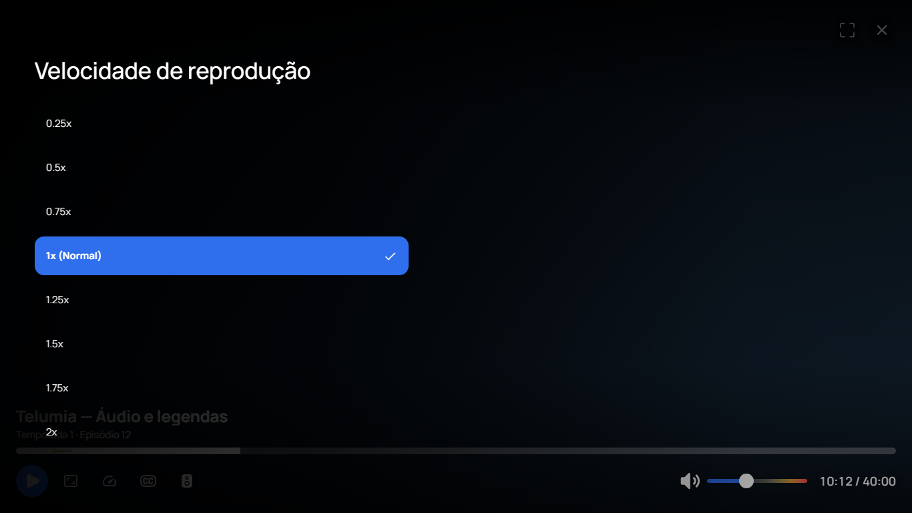
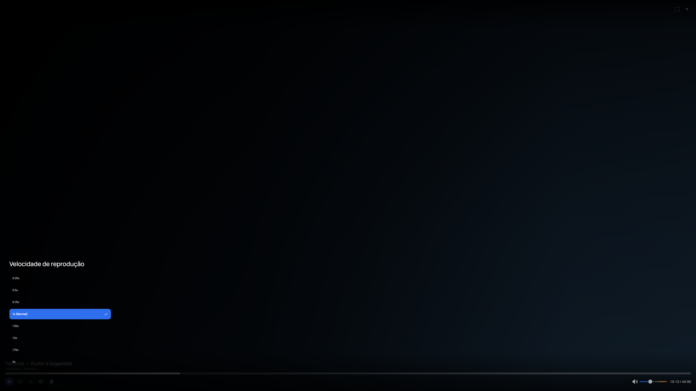

# Movimento dos controles do player Desktop

O player continua usando libmpv e a ponte nativa existente. O estado de controles
agora recebe a política visual do perfil a partir de `LocalUiMotion` e a envia
para os mesmos assets HTML/CSS/JavaScript distribuídos pelo cliente.

- **Completo:** duração e resposta de hover seguem a intensidade Sutil, Padrão ou
  Cinemática. Painéis usam os tokens compartilhados de movimento.
- **Reduzido:** fades de até 120 ms, sem deslocamento dos painéis, zoom de botões,
  drift de artwork, pulso de logos ou shimmer infinito.
- **Desligado:** transições e animações desativadas; abertura e fechamento dos
  painéis são imediatos, mantendo os controles e as ações.

A preferência de redução de movimento do sistema operacional também é respeitada;
Desligado continua prevalecendo. A implementação usa a
[media feature documentada pelo MDN](https://developer.mozilla.org/en-US/docs/Web/CSS/Reference/At-rules/@media/prefers-reduced-motion),
sem acrescentar uma biblioteca de animação ao player.

Movimento e tempo de interação são separados. O aviso contextual sem coreografia
mantém cinco segundos de leitura e a opção de pular mantém dez segundos antes de
se ocultar automaticamente. A preferência do sistema não reduz esses prazos a
um milissegundo. Mudar a política invalida a coreografia anterior; reabrir um
painel cancela seu timer de fechamento anterior. Transforms usados para centralizar
elementos ou posicionar listas virtuais são preservados.

Esses campos são da ponte local do player, sem modificar DTOs, RPCs de conta,
engine ou assinatura JNI de eventos. O teste de serialização percorre os nove
pares de modo/intensidade e verifica campos de reprodução preservados.

## Validação

A primeira tentativa, `telumia-player-motion-desktop`, executou 241 testes
selecionados e terminou com duas falhas. O teste novo detectou que o serializador
de floats normalizados limitava a intensidade Cinemática de 1,25 a 1,0. O campo
passou a serializar diretamente o valor do enum, mantendo a normalização de
volume/progresso existente. A outra falha foi `AccessDeniedException` durante
substituição atômica do arquivo de perfis no APPDATA isolado desse gate; a causa
do bloqueio de arquivo não foi determinada. A tentativa e seus relatórios ficam
preservados e não constituem aprovação, mesmo tendo produzido um MSI.

O segundo gate, `telumia-player-motion-desktop-r2`, passou em **241 testes
selecionados, 56 relatórios JUnit, zero falhas, erros ou skips** com APPDATA novo,
no commit `ee6668b370b9debbb2168622f07a08d443171ee3`. O MSI preservado tem
215.495.448 bytes e SHA-256 `20654e433fba36ee26832c781ae99290f04d6300f77a398c045044bba5fecbd0`.
Esse resultado não determina a causa da falha de arquivo na primeira tentativa.

O gate Chromium passou em **oito execuções, 72 pares de modo/intensidade e
764 verificações**, nas resoluções 1366×768, 1920×1080, 2560×1440 e 3840×2160,
cada uma com redução de movimento do sistema ativada e desativada. Verificou
abertura/fechamento por teclado, navegação de foco, comando de velocidade, retorno
do foco ao Escape, reabertura rápida, atualização simultânea de política e token
de fechamento, tempo de interação da opção de pular, limites do painel e ausência
de erros JavaScript. As capturas de 1366×768 e 4K foram revisadas visualmente.

A primeira tentativa Chromium avançou o relógio virtual enquanto uma abertura
posterior aguardava `requestAnimationFrame`; ela foi preservada como falha. O
gate final `telumia-player-motion-renderer-r2` usa relógio real, frames reais e CDP
somente no Chromium próprio com perfil temporário novo. Não altera o código de
produção nem conecta ao navegador instalado em uso pelo usuário.

O renderer usa os assets reais exportados, metadata controlada e uma ponte que
registra comandos. Ele não comprova integração JNI/WebView2, reprodução de vídeo,
conta remota ou a instalação do MSI.

[Build e MSI preservados](telumia-player-motion-desktop-r2-build-binding.json),
[inspeção do pacote](telumia-player-motion-desktop-package-inspection.json),
[tentativas e testes](telumia-player-motion-results.json),
[gate de renderização](telumia-player-motion-renderer-r2.json).

