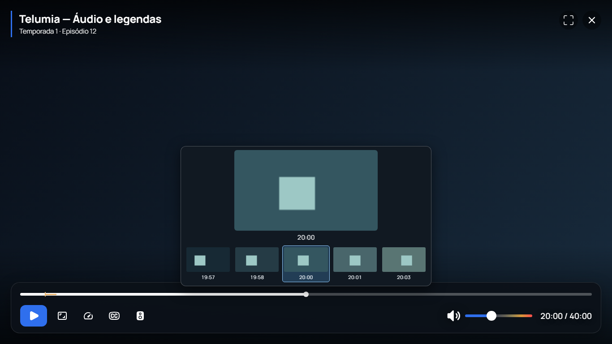

# Superfície do player Desktop

O commit `5a762d969b64226f29db511eee5f6ebe1c11725a` reorganiza os controles reais do player existente: título/episódio/fonte passam ao masthead superior, enquanto timeline e controles ficam em um dock centralizado, limitado a 1760 pixels CSS. O filmstrip mantém a área acima do seek, com centro selecionado e somente frames disponíveis. O thumb do seek fica visível e os controles usam formas retangulares; PiP possui composição compacta própria.

IDs, comandos, eventos, motores e timeline temporal permanecem integrados à ponte existente. O incremento não constitui o redesign completo do player: capítulos, Scene Info, painel técnico e os demais critérios do plano seguem abertos. A identidade final de todo o aplicativo e sua validação física também permanecem pendentes.

## Evidência preservada

- [Build e MSI](telumia-player-dock-r1-build-binding.json): 267 testes selecionados, 61 arquivos JUnit, zero falhas/erros/skips; MSI de desenvolvimento de 215.626.520 bytes, SHA-256 `e18a0371ab05a631a44b4e0e1046f31db66f686f5b0727f7741948e4eefd19de`.
- [Inspeção](telumia-player-dock-r1-package-inspection.json) e [resultado](telumia-player-dock-results.json) vinculados à mesma fonte limpa.
- [Renderer](telumia-player-dock-renderer-qa.json): oito execuções de 1366×768 a 4K, OS com/sem movimento reduzido, 72 pares de política/intensidade, 1044 verificações, zero erros JS. Conferiu geometria, separação entre metadata e ações, ocultação/liberação do mouse, carregamento, mensagem de erro/recuperação, PiP, comandos, timers, foco e filmstrip.

A captura 1366×768 abaixo foi revisada: masthead e ações não se sobrepõem, dock/frame/timestamps ficam dentro da viewport. PNGs do filmstrip e fundo são fixtures controladas de QA, sem representar mídia distribuída ou vídeo real reproduzido. O gate JNI de reprodução/capturas reais está documentado separadamente em [frames da timeline](NATIVE_TIMELINE_FRAMES.md).

A validação usa pixels CSS e não comprova escala DPI do Windows, distância de sofá, GPU/HDR físico, foco da janela de bookmarks ou interação real com WebView2. Essa revisão revelou que o estilo herdado de texto visualmente oculto limitava o rótulo de reprodução.

A correção foi compilada, testada e distribuída na **0.2.2-alpha.1**, no commit `b39b6ea79d37b7c9eb1383ef68692dd2309d664d`. O gate adicional confirma rótulo localizado visível, sem clipping de um pixel. O pacote final passou 268 testes selecionados e oito execuções/1.052 verificações de renderer, com capturas 1366×768 e 4K revisadas. [Entrega e limites](ALPHA_022.md), [release](RELEASES.md).
