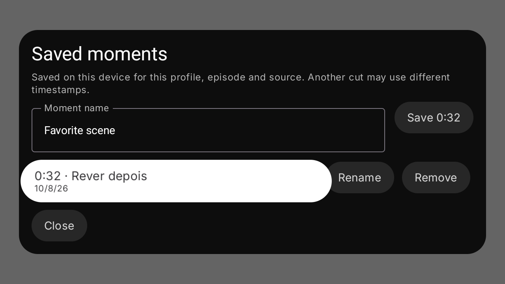
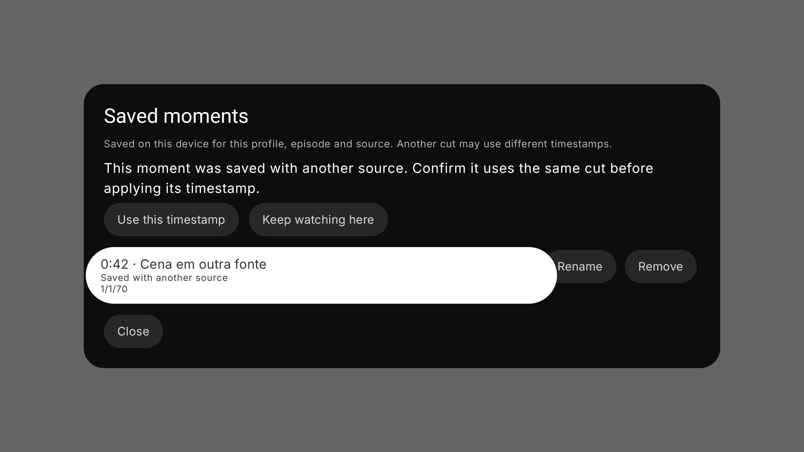

# Telumia — momentos salvos

## Incremento implementado na TV

O player existente ganhou Momentos salvos no menu de ações adicionais. O painel permite salvar o timestamp atual com nome, renomear, remover e voltar a uma cena pelo comando de seek já existente. A timeline e o overlay de seek recebem os bookmarks através da abstração de metadata temporal. Live TV, duração desconhecida e início ainda em buffering não permitem salvar timestamps inválidos.

Os registros persistem media ID/tipo, episódio, timestamp, nome, data e identidade da fonte. Ficam em `filesDir/scene-bookmarks-v1`, fora do cache, isolados por conta, identidade estável do perfil e episódio. Os nomes dos arquivos são hashes; URLs e tokens não entram nos registros. Há até 256 momentos por episódio, considerando todas as fontes, sem descartar silenciosamente momentos antigos. Escritas publicam um arquivo temporário de forma atômica; documentos inválidos ou de schemas futuros impedem mutações e são preservados.

Quando o hash do torrent e o índice do arquivo estão disponíveis, identificam a fonte sem depender de URLs temporárias. Nas demais situações usa-se o fingerprint da URL completa, sem assumir que query parameters são irrelevantes. Momentos de outra fonte continuam acessíveis, mas não entram automaticamente na timeline. Para saltar a um deles, o usuário confirma que se trata do mesmo corte. Essa confirmação não fornece evidência para Scene Info nem habilita failover automático entre edições diferentes.

O painel tem estados de carregamento, atualização, vazio, indisponibilidade e erro com retry; ações usam foco e OK/Voltar. Ao fechar, retorna ao botão de momentos no menu do player. A linha de controles ganhou scroll horizontal para que as ações adicionais continuem alcançáveis em telas menores.

## Verificação TV

O commit TV `355bcb6eb0b40ed70953f49f214e95aebc169107` passou em 153 testes selecionados, sem falhas/erros/skips, e gerou cinco APKs mais o pacote de instrumentação. Inclui dez testes reais do armazenamento e seis do controlador ligado às posições e identidades do player. Quatro casos nativos passaram em Android 16 em 720p/1080p/4K e em Android 7 em 1080p, totalizando 16 execuções. Todos usaram os mesmos APKs preservados. Foram revisadas oito capturas do painel e da confirmação, com dimensões verificadas e contraste corrigido.

Três tentativas nativas anteriores passaram em três dos quatro casos. O primeiro save após editar o nome falhou de forma intermitente: o mesmo APK passou no caso isolado. A fixture passou a aguardar a abertura e o fechamento das janelas reais do IME antes de injetar OK. A entrada de texto e a ação Concluir usam semântica Compose; OK e Voltar são teclas Android nativas. Não substituímos a ativação do botão por `performClick` nem repetimos a tecla até gravar.

Duas tentativas anteriores falharam porque `Files.readString/writeString` não existem no classpath Android usado pelo projeto; a produção passou a usar streams NIO limitados e as fixtures usam APIs compatíveis. As tentativas e a falha nativa estão preservadas e não são gates aprovados.

Os testes comprovam arquivos duráveis, ações do painel, estados de erro/indisponibilidade e callback de seek com confirmação de outra fonte. Usam fixtures controladas, foco solicitado por semântica e o idioma inglês do aparelho com nomes de momentos em português. Não comprovam navegação completa pelo menu do player, digitação física no IME, playback/seek de vídeo via Media3, conta/backend ou desempenho de TV física. Esses gates e a revisão visual em locale português continuam separados.

[Builds e pacotes preservados](telumia-scene-bookmarks-tv-ime-window-build-binding.json), [inspeção dos APKs](telumia-scene-bookmarks-tv-ime-window-package-inspection.json), [instrumentação e tentativas anteriores](telumia-scene-bookmarks-tv-native.json).

## Desktop e continuidade

A persistência equivalente foi preparada no checkout Desktop, reutilizando `ProfileAvatarScope`, NIO e os contratos existentes de metadata temporal. Passaram 184 testes selecionados, incluindo dez novos testes de armazenamento, sem falhas/erros/skips, e o MSI real do commit `eee37594736194383c26e946b1e7e29511d01aea`. O pacote foi preservado com hash e inspeção. Essa fundação ainda não tem integração com os controles nativos Windows nem é uma funcionalidade exposta no PC.

A primeira execução Desktop teve um teste de mutações locais de perfil ignorado por faltar o opt-in de isolamento; os dez testes novos passaram. O conjunto foi repetido com `Invoke-Baseline.ps1 -IsolateDesktopData`, usando APPDATA temporário próprio e a flag que permite esse teste. O gate final passou nos 184 testes. A primeira tentativa e seu skip foram preservados.

[Build Desktop isolado e MSI preservado](telumia-scene-bookmarks-desktop-storage-isolated-build-binding.json), [inspeção do MSI](telumia-scene-bookmarks-desktop-storage-isolated-package-inspection.json), [sequência de builds e tentativas](telumia-scene-bookmarks-results.json).

Nenhuma nova release foi publicada com bookmarks. Os binários `0.2.1-alpha.1` permanecem imutáveis. A implementação Desktop, os gates completos do player e a meta integral do produto permanecem em execução.
