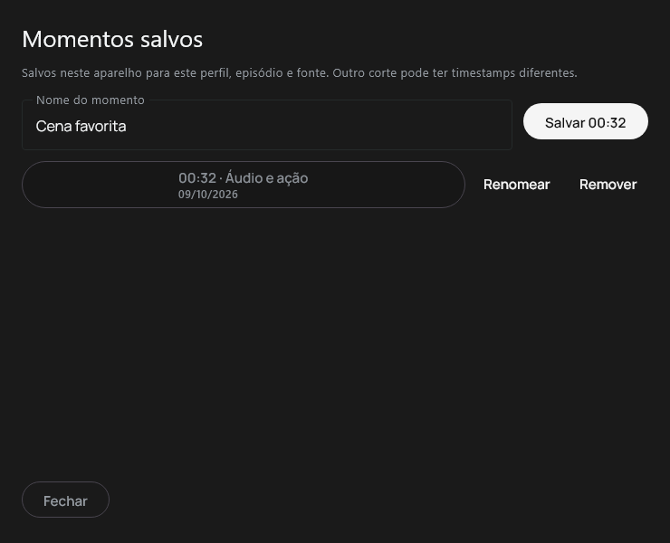

# Telumia — momentos salvos

## Incremento implementado na TV

O player existente ganhou Momentos salvos no menu de ações adicionais. O painel permite salvar o timestamp atual com nome, renomear, remover e voltar a uma cena pelo comando de seek já existente. A timeline e o overlay de seek recebem os bookmarks através da abstração de metadata temporal. Live TV, duração desconhecida e início ainda em buffering não permitem salvar timestamps inválidos.

Os registros persistem media ID/tipo, episódio, timestamp, nome, data e identidade da fonte. Ficam em `filesDir/scene-bookmarks-v1`, fora do cache, isolados por conta, identidade estável do perfil e episódio. Os nomes dos arquivos são hashes; URLs e tokens não entram nos registros. Há até 256 momentos por episódio, considerando todas as fontes, sem descartar silenciosamente momentos antigos. Escritas publicam um arquivo temporário de forma atômica; documentos inválidos ou de schemas futuros impedem mutações e são preservados.

Quando o hash do torrent e o índice do arquivo estão disponíveis, identificam a fonte sem depender de URLs temporárias. Nas demais situações usa-se o fingerprint da URL completa, sem assumir que query parameters são irrelevantes. Momentos de outra fonte continuam acessíveis, mas não entram automaticamente na timeline. Para saltar a um deles, o usuário confirma que se trata do mesmo corte. Essa confirmação não fornece evidência para Scene Info nem habilita failover automático entre edições diferentes.

O painel tem estados de carregamento, atualização, vazio, indisponibilidade e erro com retry; ações usam foco e OK/Voltar. Ao fechar, retorna ao botão de momentos no menu do player. A linha de controles ganhou scroll horizontal para que as ações adicionais continuem alcançáveis em telas menores.

## Verificação TV

O commit TV `355bcb6eb0b40ed70953f49f214e95aebc169107` passou em 153 testes selecionados, sem falhas/erros/skips, e gerou cinco APKs mais o pacote de instrumentação. Inclui dez testes reais do armazenamento e seis do controlador ligado às posições e identidades do player. Quatro casos nativos passaram em Android 16 em 720p/1080p/4K e em Android 7 em 1080p, totalizando 16 execuções. Todos usaram os mesmos APKs preservados. Foram revisadas oito capturas do painel e da confirmação, com dimensões verificadas e contraste corrigido.

Três tentativas nativas anteriores passaram em três dos quatro casos. O primeiro save após editar o nome falhou de forma intermitente: o mesmo APK passou no caso isolado. A fixture passou a aguardar a abertura e o fechamento das janelas reais do IME antes de injetar OK. A entrada de texto e a ação Concluir usam semântica Compose; OK e Voltar são teclas Android nativas. Não substituímos a ativação do botão por `performClick` nem repetimos a tecla até gravar.

Duas tentativas anteriores falharam porque `Files.readString/writeString` não existem no classpath Android usado pelo projeto; a produção passou a usar streams NIO limitados e as fixtures usam APIs compatíveis. As tentativas e a falha nativa estão preservadas e não são gates aprovados.

Os testes comprovam arquivos duráveis, ações do painel, estados de erro/indisponibilidade e callback de seek com confirmação de outra fonte. Usam fixtures controladas, foco solicitado por semântica e o idioma inglês do aparelho com nomes de momentos em português. Não comprovam navegação completa pelo menu do player, digitação física no IME, playback/seek de vídeo via Media3, conta/backend ou desempenho de TV física. Esses gates e a revisão visual em locale português continuam separados.

[Builds e pacotes preservados](telumia-scene-bookmarks-tv-ime-window-build-binding.json), [inspeção dos APKs](telumia-scene-bookmarks-tv-ime-window-package-inspection.json), [instrumentação e tentativas anteriores](telumia-scene-bookmarks-tv-native.json).

## Desktop — histórico da fundação

A persistência equivalente foi preparada no checkout Desktop, reutilizando `ProfileAvatarScope`, NIO e os contratos existentes de metadata temporal. Passaram 184 testes selecionados, incluindo dez novos testes de armazenamento, sem falhas/erros/skips, e o MSI real do commit `eee37594736194383c26e946b1e7e29511d01aea`. O pacote foi preservado com hash e inspeção. Essa fundação ainda não tem integração com os controles nativos Windows nem é uma funcionalidade exposta no PC.

A primeira execução Desktop teve um teste de mutações locais de perfil ignorado por faltar o opt-in de isolamento; os dez testes novos passaram. O conjunto foi repetido com `Invoke-Baseline.ps1 -IsolateDesktopData`, usando APPDATA temporário próprio e a flag que permite esse teste. O gate final passou nos 184 testes. A primeira tentativa e seu skip foram preservados.

[Build Desktop isolado e MSI preservado](telumia-scene-bookmarks-desktop-storage-isolated-build-binding.json), [inspeção do MSI](telumia-scene-bookmarks-desktop-storage-isolated-package-inspection.json), [sequência de builds e tentativas](telumia-scene-bookmarks-results.json).

Nenhuma nova release foi publicada com bookmarks. Os binários `0.2.1-alpha.1` permanecem imutáveis. A implementação Desktop, os gates completos do player e a meta integral do produto permanecem em execução.

## Desktop — painel integrado ao player existente

O commit `921cd6630b48eeadbb085fef2abf788a846be333` integra a persistência aos controles reais do player Desktop. O botão Momentos salvos e a tecla **D** abrem um painel Compose sobre o host nativo. A tecla **B** mantém a alternância de áudio existente. O painel permite salvar a posição consultada naquele instante no controlador libmpv, renomear, remover, listar momentos de outra fonte e solicitar seek pelo controlador existente. PiP bloqueia o comando e oculta o botão.

A conta e a identidade do perfil seguem os guards do Profile Studio; metadata de mídia/episódio vem do runtime atual. Sem proprietário, fonte disponível ou identidade válida, o recurso fica indisponível. Um ID de série sem ID de episódio não habilita o painel. Trocar conta, perfil, episódio ou fonte limpa o estado visível anterior. Leituras e escritas usam IO; uma troca de proprietário antes da operação enfileirada impede a gravação. Arquivos continuam fora do cache, por proprietário e episódio, com limites e publicação atômica existentes. A URL completa gera um hash da fonte: não se afirma que ele identifica um corte editorial. URLs renovadas exigem confirmação; marcas de outra fonte não são projetadas automaticamente na timeline.

O formulário preserva o rascunho após falha de renomeação, oferece retry e explica quando o timestamp não pode ser usado na reprodução atual. Carregamento, atualização, vazio, erro, fonte diferente e indisponibilidade têm comportamentos próprios. Escape fecha o painel e o callback solicita foco ao host nativo. Labels estão em português/inglês; strings suplementares são escapadas no JSON da ponte, sem ampliar o payload com IDs de conta/perfil nem criar um canal de texto JNI.

**257 testes selecionados passaram**, sem falhas, erros ou skips, e o MSI real foi preservado por hash. Incluem seis testes do coordenador/scopes com armazenamento real, quatro testes nativos Compose com teclado/mouse e dez testes anteriores do store. Os testes do painel comprovam persistência, save/rename/remove, confirmação e callback de seek; as três capturas de 740×600 foram produzidas pelos testes do componente em Completo/Reduzido/Desligado. Não capturam a janela modal junto ao vídeo.

Os assets HTML/JS/CSS exportados pelo build também passaram em **oito execuções Chromium**, com **72 pares de modo/intensidade e 828 verificações**. Os viewports são 1366×768, 1920×1080, 2560×1440 e 3840×2160, com preferência do SO de movimento normal/reduzido. Comprovam localização e limites do botão, comandos por clique/tecla D, preservação da tecla B, bloqueio em modal/PiP e o QA anterior de movimento/teclado. Essa ponte registra comandos; não executa JNI/WebView2, vídeo ou conta real.

O primeiro build teve duas falhas AccessDenied ao substituir preferências de addons e uma exceção `StyleAnimations` ao reabilitar o painel após erro. A exceção foi reproduzida em teste isolado; a UI passou a recriar os nós de estilo do Material3 alpha nas transições de disponibilidade, mantendo rascunho/scroll. A segunda execução perdeu seu processo durante compilação, sem causa/exit code confirmados, e foi classificada como interrompida. O runner oculto agora tem PID e logs próprios, observáveis entre continuações. A terceira passou em 256 testes/MSI. O primeiro QA Chromium revelou um label interno ainda em inglês; a correção e o guard de episódio foram compilados na quarta rodada, aprovada nos 257 testes/MSI e no QA repetido. Nenhuma dessas tentativas anteriores é apresentada como gate final aprovado.

As falhas de preferências motivaram retentativa Windows limitada a 20/40/80 ms para AccessDenied, sem substituir o arquivo anterior por fallback vazio. Erros permanentes continuam falhando, com rollback também para remoção em lote; documentos inválidos não são sobrescritos. Seis testes de armazenamento passaram, incluindo um reader Windows real que nega delete e libera o arquivo durante a retentativa. Isso prova esse comportamento controlado; não identifica qual processo provocou os AccessDenied anteriores.

[Build/pacote final](telumia-scene-bookmarks-desktop-controls-r4-build-binding.json), [inspeção do MSI](telumia-scene-bookmarks-desktop-controls-r4-package-inspection.json), [builds anteriores](telumia-scene-bookmarks-desktop-controls-results.json) e [QA/capturas e tentativa de tradução](telumia-scene-bookmarks-desktop-qa.json).

Continua pendente comprovar a janela `DialogWindow` sobre o host real, retorno de foco WebView2, seek/reprodução de vídeo pelo libmpv e interoperabilidade de conta. Os momentos locais exclusivos não são anunciados como sincronizados com o cliente oficial. Não foi publicada uma nova release: o MSI de desenvolvimento conserva o nome de versão existente e seu hash identifica esta entrega.

Em 09/10, uma tentativa adicional com os APKs preservados de `c0695add` e locale
por aplicativo `pt-BR` encerrou o processo de instrumentação antes de executar
os quatro casos. Não há stack de aplicativo no buffer de crash consultado e a
causa não foi confirmada. O locale foi restaurado e a
[tentativa foi preservada](telumia-scene-bookmarks-tv-ptbr-first-attempt.json).
Ela não constitui revisão visual em português aprovada. O gate usa o comando
[LocaleManager do AOSP](https://android.googlesource.com/platform/frameworks/base/+/refs/tags/android-16.0.0_r4/services/core/java/com/android/server/locales/LocaleManagerShellCommand.java)
somente no AVD próprio, com captura e restauração da preferência anterior.

## Revalidação TV em português: ANR de inicialização

Duas novas tentativas usaram framebuffer nativo de 1920×1080 e o APK preservado do commit `c0695add859d5ad12303ec2ea01de4aacc3d17a1`. O LocaleManager confirmou `pt-BR`, e a ausência de processo anterior foi verificada antes da instrumentação. Ambas falharam antes dos quatro casos. Na execução com diagnóstico, o Android registrou `failed to complete startup` e encerrou o processo por ANR; também registrou pressão de memória. Isso não estabelece uma falha de tradução ou uma causa específica no código.

As tentativas e a restauração de idioma/configuração constam no [relatório](telumia-scene-bookmarks-tv-ptbr-native-attempts.json). O emulador próprio foi encerrado. Não há nova captura portuguesa validada nesta rodada; os gates anteriores continuam vinculados aos seus respectivos commits.
