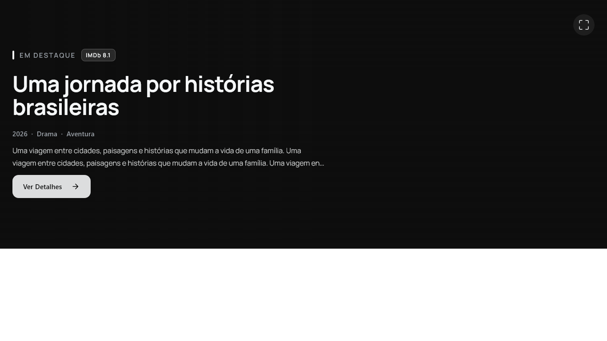
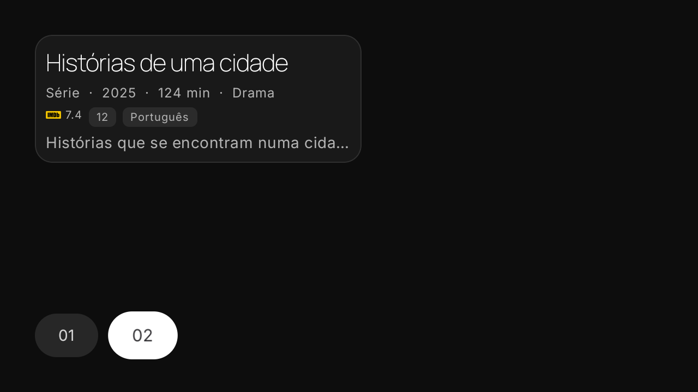
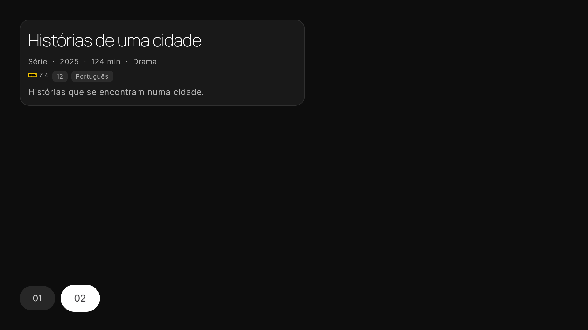
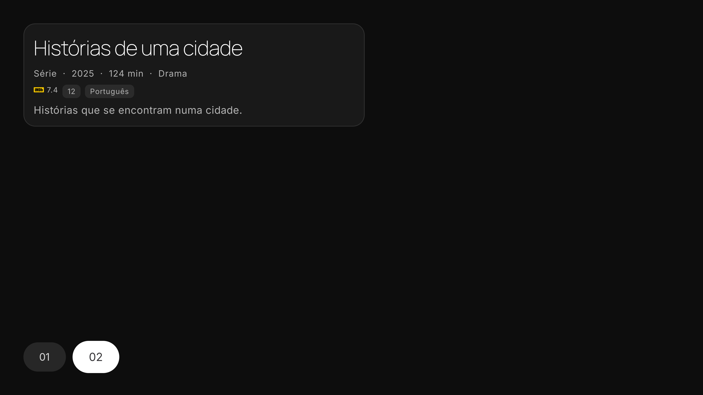

# Telumia — incremento da Home

Entrega parcial sobre os clientes nativos, em 6 de outubro de 2026. Não encerra o redesign integral aprovado.

No Desktop, o destaque usa título em Manrope, hierarquia editorial, avaliação válida quando fornecida, ano/gêneros e sinopse com largura de leitura limitada. A ação de detalhes continua abrindo a obra original. Seletores numerados aceitam teclado; hover, foco ou arraste pausam o carrossel. Os cards existentes preservam clique, Enter e menu contextual, com borda de foco e títulos de duas linhas.

Na TV, o destaque apresenta metadata em um painel adaptativo: títulos/descrição compactos em 720p, chips reais, avaliação validada e estados sem dados. Trocar o item pelo D-pad atualiza o conjunto inteiro, evitando reter avaliação de outra obra. Durante preview em tela inteira, metadata oculta deixa também a árvore de acessibilidade, sendo restaurada ao sair.

Manrope é distribuída sob SIL OFL 1.1, com licença e procedência preservadas. Não é uma fonte autoral Telumia. A preferência de fonte de corpo da TV continua válida.

## Validação reproduzível

- Desktop: 44 testes selecionados, sem falhas/erros/skips, e MSI real. Renderizador Compose em 1366×768, 1920×1080, 2560×1440 e 3840×2160. Enter abre o mesmo ID; seleção e pausa por foco são verificadas; sinopse limitada a 720 dp no teste 4K.
- TV: 72 testes unitários selecionados, sem falhas/erros/skips; APKs universal, ARM64, ARM32, x86 e x86_64 e APK de instrumentação.
- TV nativa: 27 testes no emulador próprio — três da Home, três dos detalhes e três dos componentes visuais Live TV, em cada resolução 720p/1080p/4K. O framebuffer 4K foi verificado pelas dimensões do PNG, além do `wm size`.
- [Resultados de compilação](telumia-home-results.json), [inspeção MSI](telumia-home-desktop-package-inspection.json), [inspeção APKs](telumia-home-tv-package-inspection.json) e [instrumentação](telumia-home-tv-ui-qa.json) registram commits, hashes e alcance.

## Capturas controladas

As capturas usam metadata de teste para reproduzir geometria e interação. Não demonstram disponibilidade de streaming, conta/sync, previews reais ou performance em TV física. Não são mocks presentes no produto.

## Trabalho ainda necessário

A Home completa ainda requer trailers embutidos Windows, integração de previews com capacidades do aparelho, seções reorganizáveis, Continue Assistindo enriquecido e as demais integrações previstas. O incremento posterior de [ciclo de vida dos previews](PREVIEWS.md) acrescenta exclusividade/cancelamento no PC e no pool Media3, com gates próprios. Os testes não cobrem a Home completa com conteúdo real. A instrumentação não substitui medição em hardware físico de 2 GB. A aparência de todas as outras superfícies ainda precisa ser reconstruída conforme a [meta integral](GOAL_OBJECTIVE_2026-10-05.md).

O incremento está no código dos clientes. Os downloads públicos da `0.2.0-alpha.1` permanecem fixos nos commits registrados no manifesto daquela release; não incluem esta entrega.
