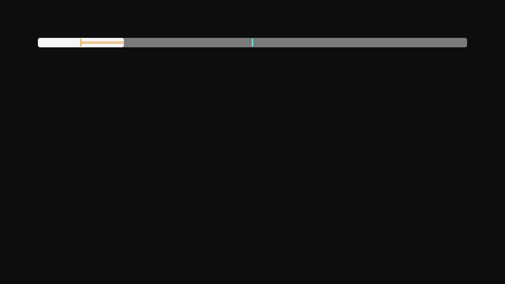
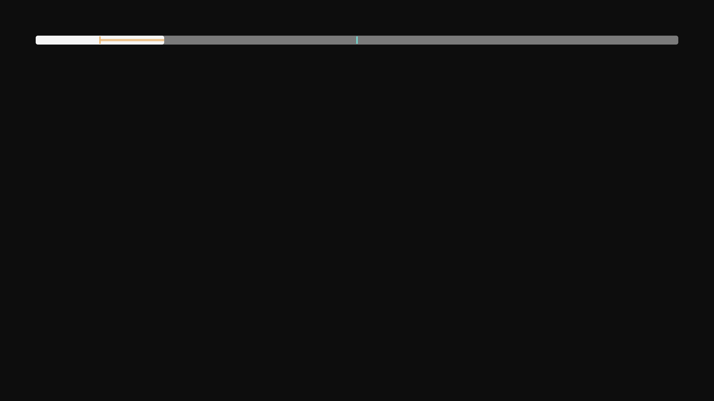

# Telumia — metadata temporal integrada ao player

Incremento de 6 de outubro de 2026, sobre os players existentes. Prepara a Fase 2; não representa a entrega de Scene Info da Fase 7.

Os dois clientes possuem um contrato de eventos temporais com identidade da obra, episódio e edição, tipos específicos, procedência e confiança explícita. A timeline limita quantidade, valida timestamps, elimina duplicatas e consulta intervalos também ao retroceder. Providers possuem timeout, cancelamento e isolamento de falhas. Eventos de cena exigem edição conhecida, provider de cena registrado e confiança suficiente; elenco geral não é convertido em elenco da cena.

Os segmentos recebidos pelo mecanismo existente de skip alimentam essa timeline sem criar requisições adicionais. Intro, recap, créditos e pós-créditos aparecem como marcações nas barras de progresso existentes. O contrato também permite capítulos e bookmarks. Um incremento posterior implementou [Momentos salvos na TV](SCENE_BOOKMARKS.md), com persistência real e projeção na timeline; o Desktop e capítulos reais continuam pendentes. Eventos de atores, música e curiosidades não geram marcações arbitrárias.

No Desktop, a integração alcança as barras Compose e o payload da ponte nativa, com renderizador HTML incluído no JAR distribuído. O renderizador valida valores, limita eventos e utiliza texto literal. Na TV, o controller limpa metadata da identidade anterior, cancela carregamentos substituídos e entrega marcações à barra e ao overlay de seek. Sem duração válida, o D-pad não confirma posições fictícias.

## Verificação

- Desktop: 93 testes selecionados, sem falhas/erros/skips, e MSI real. Incluem consultas temporais, confiança, limites, cancelamento, serialização nativa e seek Compose. Dois testes Node verificam o renderizador HTML, inclusive texto malicioso e limpeza de eventos antigos.
- TV: 83 testes unitários selecionados, sem falhas/erros/skips; cinco APKs e APK de instrumentação.
- TV nativa: nove testes de D-pad, seek, duração desconhecida e substituição de marcações em 720p, 1080p e framebuffer 4K verificado pelas capturas.
- [Builds e commits](telumia-timed-results.json), [MSI](telumia-timed-desktop-package-inspection.json), [APKs](telumia-timed-tv-package-inspection.json), [UI Desktop](telumia-timed-desktop-ui-qa.json), [UI TV](telumia-timed-tv-ui-qa.json).

As capturas utilizam fixtures controladas, incluindo um bookmark apenas para testar sua representação. Não comprovam playback completo, um bookmark persistido ou dados de cenas de uma fonte real. A ponte HTML foi testada e empacotada, mas a reprodução completa via JNI/WebView2 permanece um gate separado.

## Continuidade

Ainda faltam capítulos reais, Scene Bookmarks completos no Desktop, thumbnails correspondentes ao timestamp, filmstrip, providers de cena e o painel Scene Info. Os bookmarks TV posteriores têm seus próprios gates e limites. A evolução completa do player e os demais recursos continuam obrigatórios pela [meta integral](GOAL_OBJECTIVE_2026-10-05.md). A release pública atual `0.2.1-alpha.1` contém esta fundação temporal e permanece imutável; bookmarks posteriores ainda não estão nos seus binários.
